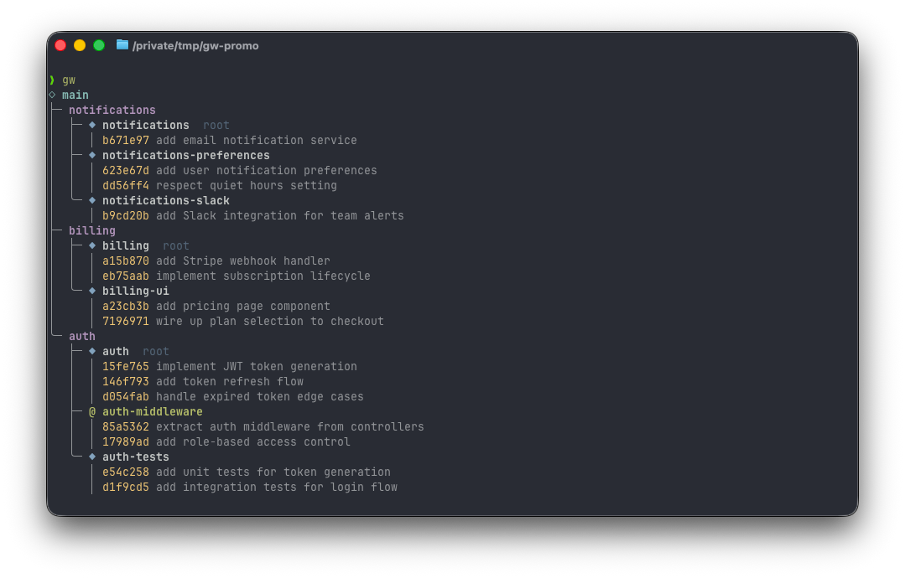

# gw

You break a big feature into multiple PRs. You push the first one for review, get feedback, commit a fix, and now you have to manually rebase every branch after it. When that PR finally gets squash-merged, you have to figure out which commit on dev matches your branch, remove it from the chain, and rebase everything again. Over and over.

`gw` handles all of that. It tracks the parent-child relationships between your branches, automatically propagates rebases through the chain, and detects squash merges so it can clean up the stack. Your branches are real git branches, your PRs are normal GitHub PRs, and gw just does the tedious coordination between them.

Everything lives in `.git/gw/` and never gets pushed to the remote.

<p align="center">
  
</p>

## Table of contents

- [Why this exists](#why-this-exists)
- [Install](#install)
- [Quick start](#quick-start)
- [Already have branches? Adopt them](#already-have-branches-adopt-them)
- [Configuration](#configuration)
- [Commands](#commands)

## Why this exists

If you stack branches, you know the pain. You update a branch in the middle of the chain and now you have to rebase everything after it. A PR gets squash-merged and you have to figure out what landed, remove the branch, and rebase the rest. It's all manual, it's error-prone, and it scales with the number of branches in the chain.

There's also the force push problem. Most stacking tools auto-rebase your entire stack onto the latest base branch when you sync. Every branch gets new SHAs and needs a force push. GitHub resets your reviewer's "viewed" state on force pushes, orphans inline comments, and loses the ability to show what changed between review rounds. So you end up making review harder in the name of keeping your stack up to date.

### Alternatives

**Graphite** has both a cloud platform and a local CLI. The local tool works but you end up working around its assumptions about how your workflow should look, and the cloud features keep pulling you toward their platform for the full experience.

**ghstack** rewrites your branches into synthetic ones for GitHub to display as individual PRs. What's on your machine doesn't match what's on GitHub, and that gets confusing when you're debugging a rebase or a PR diff doesn't look like what you see locally.

**git-branchless** is close to what you want but the squash merge detection falls over most of the time, which leaves you doing the manual cleanup work anyways. It's also a different mental model entirely, inspired by Mercurial and Phabricator, and if your team already does one-branch-per-PR with squash merges that abstraction doesn't map cleanly.

### What gw does

Your branches are real git branches. Your PRs are normal GitHub PRs. Nothing gets rewritten and nothing gets synced anywhere. gw just handles propagating rebases through the chain, detecting squash merges, and cleaning up the stack.

`gw sync` does not rebase your stack onto the latest base branch unless a branch was actually merged or you explicitly pass `--rebase`. Your stack stays pinned, your open PRs don't get force pushed because someone else merged to main, and you control when updates happen.

## Install

```
git clone https://github.com/deibeljc/git-workflow.git
cd git-workflow
cargo install --path .
```

Needs a [Rust toolchain](https://rustup.rs/). Optional: `gh` CLI for auto-detecting squash merges and showing PR status in `gw log`.

### Shell completions

Tab completion for commands, flags, and branch names:

```bash
# zsh (add to ~/.zshrc)
source <(gw completions zsh)

# bash (add to ~/.bashrc)
eval "$(gw completions bash)"

# fish
gw completions fish | source
```

### Claude Code integration

`gw` has a built-in MCP server so Claude Code can manage your stacks directly. Set it up with one command:

```bash
gw mcp-setup
```

This writes the MCP config to `.mcp.json` and you're good to go. Restart Claude Code and it can use gw tools natively.

## Quick start

```bash
# Set your base branch (if not main)
gw config set-base dev

# Create a stack
gw stack create auth

# Do work, commit, then add the next branch
gw branch create auth-tests

# See everything (just `gw` also works)
gw log

# Address PR feedback on auth, then propagate rebases
gw rebase

# Push when ready
gw push

# After auth gets squash-merged
gw sync

# Explicitly rebase onto latest base when you're ready
gw sync --rebase

# Switch between branches interactively
gw switch
```

## Already have branches? Adopt them

If you've already got a chain of branches you've been managing by hand, you don't need to recreate anything. Just tell gw about them:

```bash
gw adopt feature-api feature-tests feature-ui --base dev
```

The argument order defines the stack order, so `feature-api` becomes the root and `feature-ui` becomes the leaf. If the branches aren't already rebased into a chain, gw handles that for you and asks before making changes. You can also name the stack explicitly with `--name` or let it default to the first branch name.

This is the easiest way to migrate onto gw. You keep all your existing branches and commits, gw just starts tracking the relationships between them.

## Configuration

Config lives in `.git/gw/config.toml` and is per-repo. View it with `gw config show`.

| Setting | Default | Command | Description |
| --- | --- | --- | --- |
| `default_base` | auto-detected | `gw config set-base <branch>` | Base branch for new stacks (e.g. `dev`, `main`) |
| `delete_on_merge` | `false` | `gw config set-delete-on-merge true` | Delete local branches after sync detects they were merged |

By default, `gw sync` removes merged branches from the stack but keeps the local git branches around in case you need them. If you'd rather have sync clean everything up automatically:

```bash
gw config set-delete-on-merge true
```

## Commands

| Command | What it does |
| --- | --- |
| `gw` | Show all stacks (alias for `gw log`) |
| `gw log` | Show all stacks with branches and commits |
| `gw log --pr` | Include PR status from GitHub |
| `gw stack create <name>` | Create a new stack off the base branch |
| `gw stack delete <name>` | Remove stack metadata (branches stay) |
| `gw stack list` | List all stacks |
| `gw branch create <name>` | Add a branch to the current stack |
| `gw branch remove <name>` | Remove a branch and re-parent children |
| `gw adopt <branches...>` | Adopt existing branches into a stack |
| `gw rebase` | Propagate rebases to descendants |
| `gw rebase --continue` | Resume after resolving conflicts |
| `gw rebase --abort` | Roll back all branches |
| `gw sync` | Fetch base, detect merges, rebase stack |
| `gw sync --rebase` | Explicitly rebase stack onto latest base |
| `gw sync --merged <branch>` | Manually indicate a branch was merged |
| `gw push` | Push the current branch |
| `gw switch [branch]` | Switch branches interactively or by name |
| `gw config set-base <branch>` | Set the default base branch |
| `gw config set-delete-on-merge <bool>` | Auto-delete local branches on merge |
| `gw config show` | Show current configuration |
| `gw completions <shell>` | Generate shell completions (zsh/bash/fish) |
| `gw mcp-setup` | Configure the MCP server for Claude Code |
